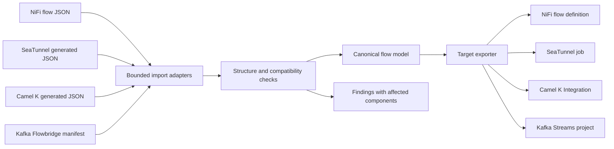

# Architecture

NiFi Flowbridge is a local, Apache-2.0-licensed importer and exporter for a deliberately bounded subset of flow definitions. It belongs to DAVANO INNOVATION LAB and is independent of the Apache Software Foundation.

## Conversion contract

The initial migration unit is one Kafka source connected directly to one Kafka sink, representing byte-payload routing only. Importers normalize supported definitions into a canonical intermediate representation (IR); exporters generate a target project and compatibility findings. Importing is file ingestion and analysis. Exporting is artifact generation. Neither operation connects to a live broker, moves data, starts a production flow, or transfers live offsets.

The four platform adapters are NiFi, SeaTunnel, Camel K, and Kafka Streams; a versioned Flowbridge interchange format exposes the canonical model directly. SeaTunnel and Camel K reverse import is limited to the generated JSON subset. Kafka reverse import reads the Flowbridge manifest, not arbitrary Java source, Kafka Connect configurations, topics, or broker state. The support matrix and report must be consulted before calling a conversion supported.

A target-native document uses the target's configuration model. The manifest records the portable subset. A successful round trip means that supported IR fields survive; it does not prove arbitrary target configuration or runtime behavior is preserved.

## Components and responsibilities

| Component | Responsibility | Boundary |
| --- | --- | --- |
| File reader | Decode bounded input and reject malformed data | No URL fetching or execution of uploaded code |
| Import adapters | Recognize source structure and extract supported nodes and connections | Unknown semantics must not be silently discarded |
| Canonical model | Represent the portable source, sink and connection contract | Does not pretend to represent every NiFi property |
| Analyzer | Report unsupported processors, graph shapes, unresolved settings and semantic risks | A blocking finding prevents a deployable conversion claim |
| Export adapters | Generate deterministic files from validated input | No deployment credentials or live changes |
| CLI and local UI | Present findings, select target, return artifact bundle | Same engine and validation policy |

New adapters should be registered behind the same import, analyze and export interfaces. Do not implement every source-to-target pair independently: four importers and four exporters are easier to validate than sixteen translation paths.

## NiFi format and semantic constraints

Prefer **Download flow definition → With external services** from a process group's menu. This produces a JSON flow definition; the external-services option matters because processors may reference services from a parent group. [NiFi user guide](https://nifi.apache.org/nifi-docs/user-guide.html).

Official exported definitions contain a `flowContents` process group, processor `identifier`/`type`/`bundle`/`properties` fields, and connections whose `source.id` and `destination.id` identify components. `selectedRelationships` is essential control-flow information. The envelope also carries controller-service and parameter-context information. A flow definition is distinct from a running NiFi server's persisted configuration or a legacy XML template. [Official flow example](https://github.com/apache/nifi/blob/main/nifi-connectors/nifi-kafka-to-s3-bundle/nifi-kafka-to-s3-connector/src/main/resources/flows/Kafka_to_S3.json).

The initial NiFi implementation accepts only the legacy `ConsumeKafka_2_6` and `PublishKafka_2_6` byte-flow processors and emits a NiFi 1.28.0 draft. NiFi 2 service-based Kafka processors are explicitly blocked. External services, parameter contexts, nested groups, ports and other unsupported topology require manual migration; exporting them from NiFi does not imply Flowbridge can translate them.

Processor names are presentation labels, not type identities. Bundle versions, service references and processor property API names determine behavior. NiFi 2's Kafka processors use a Kafka connection service; older processors can store broker configuration directly. Record processing, demarcators, expression language, dynamic properties, parameter references, branches and retry relationships require explicit mappings before acceptance.

NiFi provenance, queues, backpressure, prioritizers, controller-service lifecycle and retry behavior have no automatic one-to-one mapping into the other runtimes. Keys, headers, timestamps, tombstones, partition selection and transaction/commit behavior need particular scrutiny even for a two-node Kafka flow. The initial project is a migration aid, not a guarantee of equivalent delivery semantics.

## Target decisions

- **SeaTunnel:** emit a source/sink job configuration. The Kafka connector's `NATIVE` format supports Kafka metadata and byte values, but does not make NiFi FlowFile semantics identical. A compatible connector installation is required. [Kafka source](https://seatunnel.apache.org/docs/2.3.12/connector-v2/source/Kafka/), [Kafka sink](https://seatunnel.apache.org/docs/2.3.12/connector-v2/sink/Kafka/).
- **Camel K:** emit an `Integration` resource with a supported Camel route. JSON is used for the initial reversible subset; this is not a general YAML, XML or Java DSL parser. Deployment requires a compatible Camel K operator and Kubernetes environment. [Camel K YAML DSL](https://camel.apache.org/camel-k/2.8.x/languages/yaml.html).
- **Kafka:** generate a Kafka Streams application for the supported flow, accompanied by a portable manifest. Kafka Connect is a connector runtime and does not by itself reproduce an arbitrary processor graph. Compiling a generated project and proving broker-level behavior are distinct validation stages. [Kafka Streams developer guide](https://kafka.apache.org/39/streams/developer-guide/).
- **NiFi:** generate a flow-definition artifact for review and import into a compatible NiFi installation. The generated processors remain stopped and publisher success/failure handling must be configured before enabling. NiFi 2.x is not supported. Enable processors only after target-side validation; export generation is not evidence of a successful live deployment.

## Security model

Treat imported flow files as untrusted data. Never execute embedded scripts or expressions, dereference remote URLs, fetch NARs, or install connectors while analyzing them. Bound file size, decompression, nesting and component counts. Reject unsafe/ambiguous input rather than recovering silently. Render names and findings as text in the UI.

Credentials are not a portability feature. Do not include secrets in generated archives, findings, logs, fixtures, issue reports or repository history. Unsupported authentication settings must be visible as findings; operators configure target authentication separately. Local-only serving is the default deployment model; public multi-user hosting needs an additional authentication and authorization design.

## Validation and release evidence

Every supported mapping needs an input fixture, expected normalized model, generated output, reverse-import test and unsupported-property tests. Test malformed graphs and hostile inputs as well as the happy path. Target-native parsing, compilation and live record-transfer tests add separate evidence; document which were actually run for a release. Do not infer runtime compatibility from a JSON round-trip test.

Before production use, test representative records and failure conditions in a non-production target: binary payloads, empty/null values, keys, headers, ordering, restarts, replay, duplicate handling and transaction behavior. A release must publish its actual test results and supported target versions.
